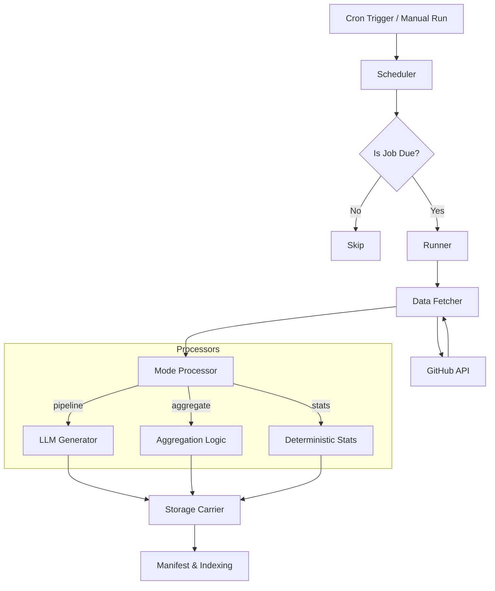

# System Architecture

GitHub Reporter is a GitOps-style reporting engine that transforms GitHub activity into summarized reports (Markdown or JSON) using LLMs.

## Philosophy: GitOps for Reporting

The system treats your configuration file (`jobs.config.ts`) as the single source of truth.
- **Declarative**: You define *what* reports you want, and the system ensures they are generated.
- **Versioned**: Your reporting logic lives in your repository, allowing you to track changes to prompts and schedules.
- **Ephemeral**: The runner is designed to be stateless, relying entirely on the storage carrier (Local or S3/R2) for historical state and indexing.

---

## High-Level Flow

The following diagram illustrates the lifecycle of a reporting run, from the initial trigger to the final storage write.



---

## Core Components

### 1. Scheduler (`src/scheduler.ts`)
The scheduler doesn't just run jobs; it makes "decisions" based on **Slots**.
- **Slots**: A deterministic time window (e.g., "yesterday" for a daily job).
- **History Tracking**: It checks the storage's `latest.json` for a job to see if the current slot has already been completed.
- **Backfilling**: If `backfillSlots` is configured, the scheduler will trigger runs for missing historical windows.

### 2. Data Fetcher (`src/github.ts`)
Optimizes GitHub API usage and LLM context tokens using **Data Profiles**:

| Profile | Level of Detail | Primary Use Case |
| :--- | :--- | :--- |
| `minimal` | Counts and metadata only | Stats & Dashboards |
| `standard` | Metadata + Commits + Diff Summaries | Daily Changelogs |
| `full` | Everything + Code Snippets + PR/Issue details | Deep Technical Analysis |

### 3. Processors (`src/processors/`)
- **Pipeline Mode**: The "standard" path. Fetches data -> Sends to LLM -> Generates Report.
- **Aggregate Mode**: Chains reports together. It reads *previous* artifact outputs (e.g., 7 daily reports) and summarizes them into one (e.g., a weekly summary). This avoids re-fetching from GitHub.
- **Stats Mode**: For deterministic data. It calculates activity metrics without using an LLM, outputting pure JSON.

---

## Data Model & Storage

The system uses a flat, index-heavy storage structure to ensure the **Viewer** remains fast regardless of the number of reports.

### Folder Structure
```text
{prefix}/
├── {ownerType}/{owner}/{jobId}/
│   └── {slotKey}/
│       ├── manifest.json      # Full technical metadata
│       ├── summary.json       # Visual metadata for the calendar UI
│       └── output.{md|json}   # The actual report artifact
│
└── _index/{ownerType}/{owner}/{jobId}/
    ├── latest.json            # Pointer to the most recent success
    └── {YYYY-MM}.json         # Monthly index of all runs
```

### Manifests: The Source of Truth
Every run generates a `manifest.json`. This file is the bridge between the **Runner** (which creates it) and the **Viewer** (which consumes it). It contains:
- Job identity and version.
- Timing metrics (duration, generation time).
- LLM metadata (model used, token counts).
- Status (success or failure with error messages).

---

## The Viewer

The Viewer (Next.js) is a "dumb" frontend. It does not have a database.
1. It reads the **Job Registry** to see what jobs exist for a given owner.
2. It fetches **Monthly Indices** to populate the calendar.
3. It fetches individual **Manifests** and **Outputs** when a user clicks a specific run.

This architecture allows the Viewer to be extremely lightweight and secure, as it only requires read-access to the storage carrier.
